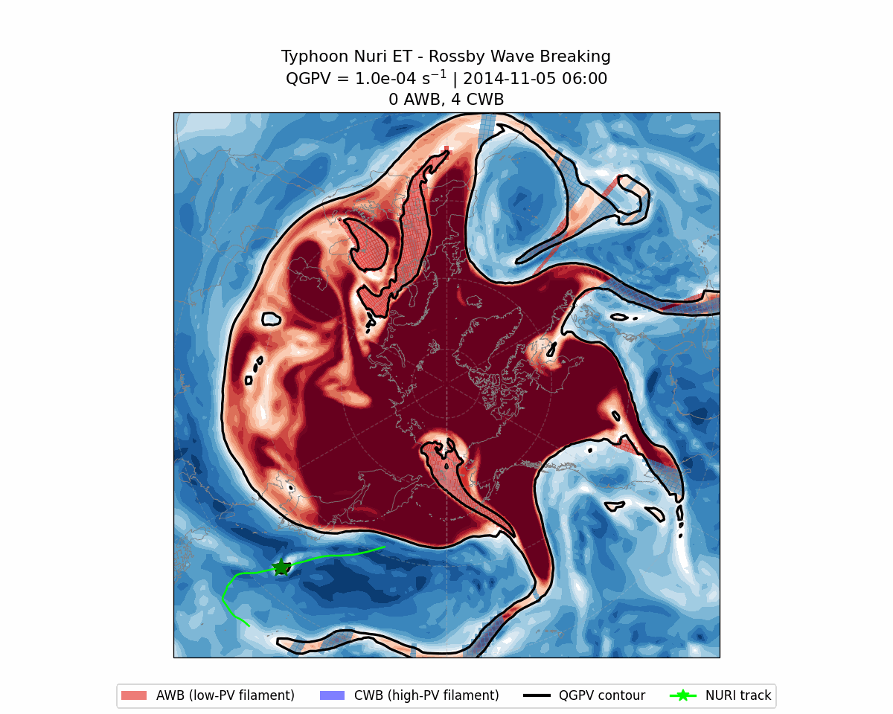
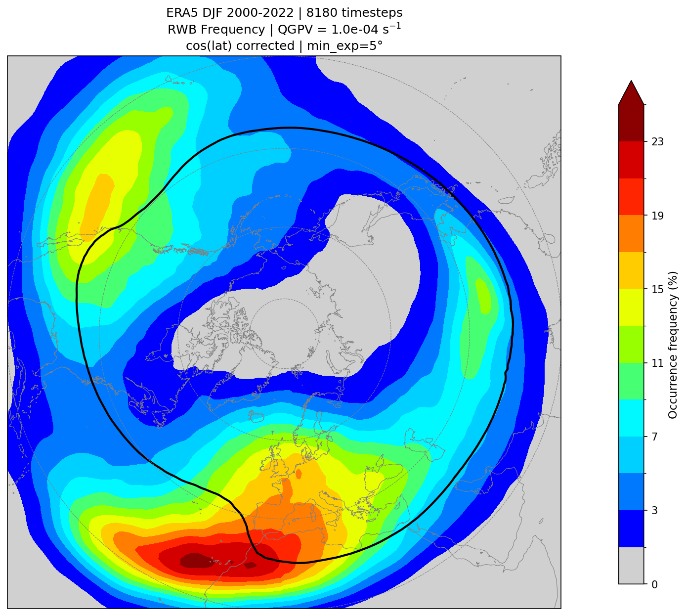

# Wave Breaking Detection Using QGPV

Detect, classify, and map Rossby Wave Breaking (RWB) events in the Northern
Hemisphere using quasi-geostrophic potential vorticity (QGPV) contour analysis
on ERA5 reanalysis data.



*Animated RWB detection during Typhoon Nuri's extratropical transition (Nov 5–7, 2014). Red = anticyclonic wave breaking (AWB), blue = cyclonic wave breaking (CWB), black contour = QGPV at 1×10⁻⁴ s⁻¹, green star = Nuri.*



*DJF (2000–2022) RWB occurrence frequency from ERA5 QGPV at 10 km. Gray shading indicates < 1% frequency. Black contour = mean QGPV at 1×10⁻⁴ s⁻¹.*

## References

This tool builds on the following work:

- **Barnes and Hartmann (2012)** — Overturning index for RWB detection.
  [DOI: 10.1029/2012JD017469](https://doi.org/10.1029/2012JD017469)
- **Wernli and Sprenger (2007)** — Streamer and cut-off concepts.
  [J. Atmos. Sci., 64, 1556–1570](https://journals.ametsoc.org/view/journals/atsc/64/5/jas3912.1.xml)
- **Kaderli (2023)** — WaveBreaking Python package for RWB detection,
  classification, and tracking.
  [GitHub: skaderli/WaveBreaking](https://github.com/skaderli/WaveBreaking) ·
  [DOI: 10.5281/zenodo.14214463](https://doi.org/10.5281/zenodo.14214463) ·
  [Master thesis](https://occrdata.unibe.ch/students/theses/msc/406.pdf)
- **Huang, Polster, and Nakamura (2025)** — `falwa` Python package for
  Finite-Amplitude Local Wave Activity diagnostics, including QGPV
  computation on pseudo-height coordinates.
  [GitHub: csyhuang/hn2016_falwa](https://github.com/csyhuang/hn2016_falwa) ·
  [Geoscience Data Journal, 12(2), e70006](https://doi.org/10.1002/GDJ3.70006)

QGPV on pseudo-height levels is used here because it is the same variable
needed to compute Finite-Amplitude Local Wave Activity (FALWA). The QGPV
computation follows the formulation in
[Huang and Nakamura (2016, JAS)](https://doi.org/10.1175/JAS-D-15-0194.1)
and is implemented in the
[falwa](https://github.com/csyhuang/hn2016_falwa) package.

## How This Differs from WaveBreaking

The contour extraction and overturning counting approach is adapted from the
[WaveBreaking](https://github.com/skaderli/WaveBreaking) package by Severin
Kaderli.  The key differences are:

| Aspect | WaveBreaking | This tool |
|--------|-------------|-----------|
| **Input variable** | PV on isentropic surfaces | QGPV at 10 km height |
| **Contour level** | 2 PVU (dynamic tropopause) | 1×10⁻⁴ s⁻¹ (QGPV equivalent) |
| **Classification** | East-west orientation of endpoints, or momentum flux sign | Mean QGPV inside the filament vs. contour level |
| **Filament selection** | Bounding rectangle of all overturning points | Pair-based: gaps processed in consecutive pairs, smaller gap = filament |
| **Multiple filaments** | One event per overturning group | N clusters → ⌊(N−1)/2⌋ independently classified filaments |
| **Cut-off classification** | `mean_var` from polygon spatial join | Mean QGPV over all enclosed grid cells |
| **Minimum feature size** | `min_exp = 5°` longitudinal | Same, plus `min_filament_lat = 3°` meridional for filaments |
| **Output format** | `geopandas.GeoDataFrame` polygons | Binary `xarray` masks per timestep (NetCDF) |

## Requirements

```
numpy
pandas
xarray
netCDF4
scikit-image
scipy
matplotlib
cartopy
typer
```

Install with:

```bash
pip install -r requirements.txt
```

## Usage

### 1. Generate masks

Process all QGPV files and save per-month RWB mask NetCDFs:

```bash
python generate_masks.py \
    --qgpv-directory /path/to/qgpv/ \
    --output-directory /path/to/wave_breaking/
```

Each output file `rwb_masks_YYYY_MM.nc` contains:
- `rwb_mask_awb(time, lat, lon)` — anticyclonic wave breaking mask (0 or 1)
- `rwb_mask_cwb(time, lat, lon)` — cyclonic wave breaking mask (0 or 1)

Options: `--contour-level` (default 1×10⁻⁴ s⁻¹), `--overwrite`.

### 2. Plot DJF climatology

Compute and plot the DJF occurrence frequency from previously generated masks:

```bash
python plot_climatology.py \
    --mask-directory /path/to/wave_breaking/ \
    --output-directory /path/to/figures/ \
    --qgpv-directory /path/to/qgpv/
```

The optional `--qgpv-directory` adds a mean QGPV contour overlay.

### 3. Animate case study

Generate an animated GIF of RWB detection evolving over time:

```bash
python animate_case_study.py \
    --qgpv-file /path/to/qgpv/2014_11_qgpv.nc \
    --output-directory /path/to/figures/ \
    --title-prefix "Typhoon Nuri ET - Rossby Wave Breaking" \
    --year-month "2014-11" \
    --start-index 8 --end-index 20 \
    --ibtracs-file /path/to/IBTrACS.WP.v04r00.nc \
    --storm-name NURI --storm-season 2014 \
    --central-longitude 180 \
    --fps 2
```

### 4. Plot case study

Visualize RWB detection on individual timesteps from a QGPV file:

```bash
python plot_case_study.py \
    --qgpv-file /path/to/qgpv/2014_11_qgpv.nc \
    --output-directory /path/to/figures/ \
    --title-prefix "Typhoon Nuri ET" \
    --marker-lon 155 --marker-lat 30
```

## Method

1. **Contour extraction** — The QGPV field is periodically extended by 120°
   in longitude.  Contours are extracted at the specified level using
   `skimage.measure.find_contours` in array index space.  The widest contour
   (largest longitudinal expansion) is selected as the main jet contour.
   Duplicate contours from the periodic extension are removed.

2. **Overturning detection** — At each longitude, the contour's latitude
   crossings are grouped into clusters (gap > 1 grid cell starts a new
   cluster).  A longitude is marked as overturning if it has ≥ 3 clusters and
   the largest inter-cluster gap is ≥ 5° (configurable).  Consecutive
   overturning longitudes are grouped into events with a minimum 5°
   longitudinal expansion.

3. **Filament identification** — Inter-cluster gaps at each longitude are
   processed in consecutive pairs from the equatorward side.  In each pair,
   the smaller gap is the filament (the narrower tongue of displaced air).
   This yields 1 filament per 3 clusters, 2 per 5, 3 per 7, etc.

4. **Classification** — Each filament is classified by the mean QGPV over all
   grid cells in the gap:
   - mean QGPV > contour level → **CWB** (cyclonic; high-PV intrusion
     equatorward)
   - mean QGPV < contour level → **AWB** (anticyclonic; low-PV intrusion
     poleward)

5. **Cut-off detection** — All closed contours (other than the main jet) with
   ≥ 5° longitudinal expansion and < 90° span are identified as cut-offs.
   Classification uses the mean QGPV over the enclosed area.

6. **Masking** — Filament gaps and cut-off interiors are filled into binary
   masks, independently classified at each longitude.

## License

MIT
